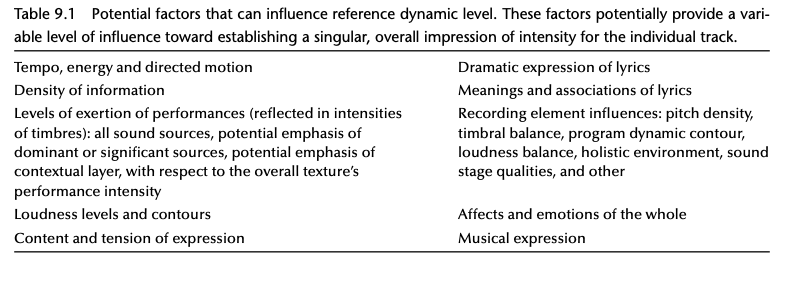
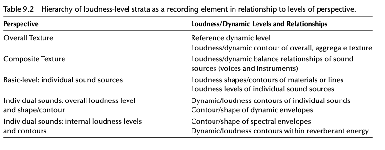
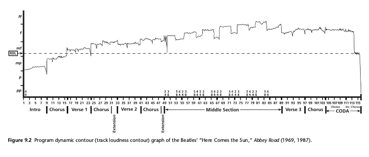

+++
title = "Loudness, the Confluence of Domains and Deep Listening"
outputs = ["Reveal"]
[reveal_hugo]
theme = "beige"
margin = 0.2
separator = "##"
+++

## What is Loudness? Perception vs. Physics

- **Loudness:** How loud we *feel* or *perceive* a sound is.
- It's related to physical sound pressure (amplitude), but it's **subjective**.
- Our ears hear different frequencies (pitches) at different perceived loudness levels, even if their physical intensity is the same.
- Context matters! Our biases, expectations, and environment change how loud we think something is.

{}

- Loudness is essentially the perceived intensity or magnitude of sound. While related to the physical measurement of sound pressure levels (SPL), it's fundamentally a psychological experience.
- Our perception of loudness isn't just about the sound itself; it's influenced by non-sensory factors like personal biases, listening context, and even surprise or attention.
- What one person considers "loud" can vary greatly based on cultural background, environment, and even their current emotional state. This subjectivity is key.
- Remember the equal-loudness contours (like Fletcher-Munson curves): our hearing sensitivity varies significantly across frequencies, meaning a 1kHz tone might sound much louder than a 100Hz tone at the same physical SPL.

{}

---

## Loudness as a Recording Tool

- Producers and engineers actively **shape loudness** in recordings.
- They can make sounds seem louder or softer than they were in the original performance, creating unique sonic textures.
- When analyzing recordings, we try to focus on the **sensation of loudness itself**, separate from performance energy (intensity) or sound color (timbre).
- This requires **focused, critical listening**.

{}

- Manipulating loudness is a fundamental technique in recording and mixing. It allows creators to craft a sonic landscape that might differ significantly from acoustic reality, emphasizing certain elements or creating specific moods.
- As a recording element, loudness refers specifically to the perceived magnitude or amplitude sensation. It's useful to try and isolate this sensation from the performer's physical exertion (intensity) or the sound's timbral characteristics during analysis.
- Developing the skill to listen specifically for loudness requires practice. It helps in approximating levels relative to a reference point (like the RDL) and tracking how loudness changes over time (the contour).
- While loudness makes sounds audible and gives them presence, it doesn't automatically make them prominent (attention-grabbing).

{}

---

## Loudness vs. Prominence: What's the Difference?

- **Loudness:** How intense a sound *feels* subjectively.
- **Prominence:** What grabs your **attention** in the mix.
- **Key Idea:** The most prominent sound isn't always the most intense (SPL)
    - Example: A quiet but unexpected shaker entry might be more *prominent* than a constant loud pad sound.
- Attention directs perception

{}

- Our attention plays a huge role in listening: focusing intensely on a specific sound can actually make it seem more intense than it physically is relative to other sounds. This highlights the critical difference between *prominence* (what stands out psychologically) and *loudness* (the perceived intensity).
- What makes a sound prominent? It could be its loudness, but it could also be factors like:
    - **Novelty:** A new sound entering the texture.
    - **Timbre:** A unique or contrasting sound color.
    - **Spatial Location:** Appearing in an unexpected place in the stereo field.
    - **Rhythm:** A syncopated or attention-grabbing rhythmic pattern.
    - **Expectation:** Hearing something you were anticipating.

{}

---

## Prominence Example & Musical Dynamics

- **Dynamics (in Music):** More than just volume changes; It includes the *overall* shifts in expression, energy, and intensity, often involving changes in both loudness *and* timbre, articulation, and performance feel.
- **Example:** Phil Spector's mix of "Let It Be" - the hi-hat entry (0:53) becomes highly *prominent* mainly due to its sudden appearance and timing (surprise!), not just its volume level.
- <iframe allow="autoplay *; encrypted-media *;" frameborder="0" height="150" style="width:100%;max-width:660px;overflow:hidden;background:transparent;" sandbox="allow-forms allow-popups allow-same-origin allow-scripts allow-storage-access-by-user-activation allow-top-navigation-by-user-activation" src="https://embed.music.apple.com/us/album/let-it-be/1441164495?i=1441164738"></iframe>

{}

- The "Let It Be" hi-hat example (at 0:53 in the Spector mix) clearly demonstrates prominence driven by context rather than sheer level. Its unexpected entry dramatically shifts the listener's focus and alters the perceived balance of the mix at that moment.
- Remember that musical dynamics are a broad concept encompassing the expressive ebb and flow of energy. While loudness changes are a key part, dynamics also involve alterations in sound color (timbre), how notes are played (articulation), and the performer's conveyed energy, all working together. When analyzing, try to distinguish the specific sensation of loudness from these interconnected expressive elements.

{}

---

## Why Measuring Perceived Loudness is Tricky

- **Equal Loudness Contours:** Same physical level sounds different across frequencies.
- **Subjective Increments:** Hard to agree on standard steps of "how much louder" something feels.
- **Confusion with SPL:** Sound Pressure Level (dB) is physical, loudness is perceptual. They don't scale linearly.
- **Limitations:** No perfect "perceived loudness meter" exists, though modern methods (like LUFS) try to approximate it better than simple peak or RMS meters.

{}

- The non-linear relationship between frequency and perceived loudness (equal-loudness contours) makes creating a single, simple loudness scale difficult.
- Defining perceptual increments (like "twice as loud") is challenging because loudness is a subjective sensation, unlike objective measures like frequency (pitch) or physical sound pressure.
- People often mistakenly equate decibels (SPL) directly with loudness. While related, doubling SPL doesn't necessarily double perceived loudness. This distinction is crucial.
- Current measurement methods, including psychoacoustic models, struggle to capture the full complexity of human loudness perception across diverse sounds and contexts, though standards like LUFS provide a useful, standardized approximation.

---

{}

## Measuring Loudness: Meet LUFS

- **LUFS:** Stands for **Loudness Units Full Scale**.
- It's the modern, standardized way to measure **perceived loudness** in digital audio.
- **Goal:** To measure loudness more like humans actually *hear* it, unlike older methods (Peak, RMS dB).
- **Why?** Creates consistency across platforms (broadcast, streaming, etc.). Essential for mastering today.

{}

- LUFS is based on international standards like ITU-R BS.1770. Its development aimed to solve the problem of wildly different loudness levels between songs or programs on TV, radio, and streaming services.
- A key feature is the use of 'K-weighting,' an EQ curve applied during measurement that emphasizes frequencies where human hearing is most sensitive and de-emphasizes very low and very high frequencies, better reflecting our perception.
- This approach provides a much more meaningful measure of subjective loudness compared to simple peak levels (which ignore duration) or basic RMS levels (which don't account for frequency sensitivity).

{}

---

## Key LUFS Measurements

- **Integrated LUFS:** Average loudness over the *entire* track.
    - *Use:* Meeting overall loudness for streaming
- **Short-Term LUFS:** Average loudness over the last 3 seconds.
    - *Use:* Checking loudness of song sections.
- **Momentary LUFS:** Average loudness over the last 400 milliseconds (approx).
    - *Use:* Monitoring immediate loudness and peaks.
- **True Peak (dBTP):** The absolute highest peak level, even *between* samples.
    - *Use:* Preventing distortion/clipping during playback or data compression. 

{}

- Think of **Integrated LUFS** as the main value representing the track's overall loudness impression from start to finish. This is the number usually specified by streaming platforms.
- **Short-Term LUFS** gives you a rolling window view, useful for seeing how loudness changes between different parts of the song or for maintaining consistency within a longer program.
- **Momentary LUFS** reacts very quickly, showing brief spikes in loudness. Useful for catching sudden loud hits or ensuring dialogue intelligibility isn't momentarily overwhelmed.
- **True Peak (dBTP)** is critical because digital audio can have peaks *between* the sampled points that standard peak meters miss. These 'inter-sample peaks' can cause clipping when the audio is converted back to analog or encoded with lossy codecs (like MP3/AAC). Controlling True Peak ensures clean playback everywhere. It's measured in dB relative to full scale (dBFS), but the 'TP' indicates inter-sample peak detection.

{}

---

## Putting Loudness Meters to Use

- Listen actively while watching a LUFS meter (routed through software like Reaper).
- Compare the LUFS readings of different songs (e.g., older vs. newer tracks).
- Use tools like [MLoudnessAnalyzer](https://www.meldaproduction.com/download/documentation/MLoudnessAnalyzer.pdf) to visualize loudness over time.
- This helps develop your ear for perceived loudness and understand how tracks meet delivery standards.

{}
This slide provides practical steps. Routing audio through a DAW like Reaper allows real-time LUFS monitoring. Comparing different tracks highlights differences in mastering practices and target levels over time (e.g., the "loudness wars" vs. current streaming normalization). Tools like Melda's analyzer offer visualization of Momentary, Short-Term, and Integrated LUFS, as well as True Peak, making the concepts more tangible. Actively using these tools alongside listening is key to understanding their application.
{}

---

## Key Loudness Concepts in a Mix

- **Loudness Balance (Musical Balance):** How loud individual instruments/sounds are *relative to each other*. Crucial for the mix's character.
- **Reference Dynamic Level (RDL):** The track's overall *impression* of intensity or energy level. A stable reference point.
- **Track Loudness Contour:** The *shape* of the overall loudness (combination of all sounds) as it changes throughout the entire track.

{}

- **Loudness balance** is fundamental to mixing – it determines what elements are foreground, background, and how they interact. It's established through fader levels, processing, and arrangement.
- The **Reference Dynamic Level (RDL)** isn't a specific dB or LUFS value, but rather the *holistic feeling* of the track's central intensity level – considering performance energy, tempo, instrumentation, etc. It acts as a perceptual anchor against which other loudness levels within the track are judged.
- The **Track Loudness Contour** (or Program Dynamic Contour) represents the moment-to-moment changes in the overall loudness of the entire mix. Visualizing this shape helps understand the track's dynamic journey and structure.

{}

---

## Understanding the RDL (Reference Dynamic Level)

- Think of it as the track's 'home base' or **central intensity level**.
- It's a *holistic feeling* reflecting the overall energy, performance force, emotion, and tempo.
- We use this felt RDL as a **reference point** to judge how loud or soft other parts of the track feel *in context*.
- Related to the idea of **"Crystallized Form"** - the track's core essence felt all at once.

{}

- The RDL encapsulates the overall intensity signature of a track. It's derived from the interplay of all sounds, musical materials, performance gestures, and even lyrical meaning. It's experienced as a single, stable level of intensity.
- Interpreting the RDL is a qualitative assessment. It involves reflecting on the track's felt energy and essence without getting lost in moment-to-moment details. It's about grasping the track's singular, coherent whole.
- The concept of "Crystallized Form" represents perceiving the track's entire essence—its shape, character, energy, meaning—instantaneously, as a unified presence. The RDL is a key component of this overall intensity aspect of the crystallized form.
- While subjective, the RDL aims to capture a shared cultural understanding of the track's intensity, acknowledging that familiarity can refine this perception over time.

{}

---

## RDL

---

## The Track Loudness Contour

- The **overall loudness journey** of the entire track, moment by moment.
- It's the **combined loudness** of *all* instruments and sounds mixed together.
- Imagine a single master volume meter needle dancing throughout the song – that's the contour.
- This changing shape adds **drama, movement, and structure** to the music.

{}
At the highest level of perspective, the track is distilled to a single sensation of loudness; we perceive this level to change continually and to form a contour across the entire track.

This can also be called the "program dynamic contour" or "track loudness contour."

The track loudness contour is the single loudness-level of the track’s aggregate sound; it is the result of the combination of all source loudness levels. It helps some to envision this sensation and concept by thinking of a single VU (voltage unit) meter that displays a representation of the signal level, following the loudness level of the program as it potentially changes at every moment.
{}

---

## Overall Loudness Level of the Track

{}
This image illustrates the hierarchy: the overall track loudness contour sits at the top, representing the aggregate of all underlying source loudness levels and their individual contours.
{}

---

## Loudness Shapes and Structure

- Loudness exists at different **levels**: the whole track, sections, individual sounds.
- The **shape of the track loudness contour** is structurally important!
- It can highlight sections (verse vs. chorus), build tension, and provide release.
- Example: "Here Comes the Sun" uses loudness changes to define its form.

{}

- Just like pitch or rhythm, loudness can be analyzed hierarchically. We can discuss the loudness of a single drum hit, a whole drum pattern, a verse section, or the entire track.
- The track loudness contour, the top level of this hierarchy, often mirrors the musical structure. Changes in instrumentation, texture, and performance intensity naturally create loudness shapes that define sections.
- Engineers and producers deliberately craft this contour through arrangement, mixing, and automation to enhance the music's emotional impact and narrative flow.
- In "Here Comes the Sun," the analysis shows how distinct loudness shapes correspond to structural divisions (like verses, choruses, bridge), contributing significantly to the listener's experience of the song's form and dynamic journey.

{}

---

## "Here Comes the Sun" - Loudness Contour Example

{}
Figure 9.2 illustrates the changes in overall loudness level throughout the track “Here Comes the Sun” (1969, 1987). The graph contains the reference dynamic level of the track (RDL, shown as a line, likely around low mf), against which the contour can be heard. Imbedded in the contour are shapes of loudness that correspond to structural divisions; as the shapes emerge within one’s hearing of the track, their role in defining sections through their repetition becomes apparent. The loudness shape of the track is clearly evident from its beginning at the lower portion of mp to its peak within ff. The wide dynamic range of the track contains subtle changes of loudness as well as large and sudden shifts.

“Here Comes the Sun” is among the uncommon tracks in which the reference dynamic level is prominently experienced. During the final moments of the coda, the level of the track loudness contour matches the track’s RDL; the reference dynamic level is audible as the track’s overall loudness arrives at the track’s overall sense of energy, exertion, and expression (that is the RDL). At this moment, the low mf RDL delivers a sense of arrival and a settling in the place of the conception and expression in which the track exists. It is common for a track to arrive at its RDL as an important occurrence, but it is not common for it to be a point of arrival that provides aesthetic closure to a track.
{}

---

## Beyond Loudness: The Confluence of Domains

A recorded track isn't just sound – it's a **blend** of three key areas:

1.  **Music:** Notes, rhythms, harmony, melody, structure.
2.  **Lyrics:** Words, meaning, story, poetic devices.
3.  **Recording:** Mic choices, effects (reverb, delay), mixing decisions (panning, EQ, *loudness balance*), performance capture.

These domains **merge and interact** to create the final *overall sound quality* and meaning.

{}

- This concept emphasizes that a recording is more than the sum of its parts. It exists as a multidimensional texture where elements from music, lyrics, and the recording process itself converge.
- The mix stage is a critical point of confluence, where decisions about spatial image (panning, width), depth (reverb, delay), timbral balance (EQ), and loudness balance shape how these domains are presented together.
- The interplay *between* these domains generates unique qualities and meanings that might not exist in any single domain alone. For example, the way a specific lyric is sung (music/performance) and processed with reverb (recording) creates a combined effect.

{}

---

## Timbre: The Glue Between Domains

- **Timbre:** The unique 'sound color' or quality of an instrument or voice. What makes a trumpet sound different from a violin playing the same note at the same loudness.
- Timbre acts like **glue**, binding elements from Music, Lyrics, and Recording together through the actual *sound*.
- It's not just *one* thing – it emerges from the blend (a **multi-domain gestalt**).
- Things like the range of frequencies a sound occupies (**pitch density**) and the **loudness balance** of its internal parts contribute to its overall timbre.

{}

- Timbre is a complex percept that integrates various acoustic properties. It doesn't belong exclusively to music (instrument choice) or recording (mic/EQ choices) but emerges from their interaction during performance and production.
- Understanding timbre involves considering its physical attributes (waveform, spectrum), how we perceive it (bright, dull, rough, smooth), how we interpret it (warm, cold, aggressive), and even the imagined physical action creating it (bowing, striking, blowing).
- Concepts like pitch density (how wide or narrow a sound's frequency footprint is) and the internal loudness balance of harmonics and noise components are part of what defines the track's overall timbral texture, influenced by both musical arrangement and recording choices.

{}

---

## Deep Listening: Hearing More Detail

- **Deep Listening:** Paying extremely close, focused **attention** to sound.
- It means hearing the subtle details *within* sounds – the texture of a voice, the decay of a reverb, the attack of a drum.
- Different from casual, everyday listening. Requires **intention**.
- Crucial for noticing the nuances of recording choices and how different elements interact.
- Inspired by composers like Pauline Oliveros and Pierre Schaeffer.

{}

- Deep listening involves a deliberate focus on sonic details at any level, from the overall mix down to the micro-textures within a single sound. It's about actively engaging with sound beyond its surface or primary function.
- This practice connects to both analytical listening (identifying musical events, structures) and critical listening (evaluating sound quality, making judgments about recording choices).
- It requires consciously directing attention to aspects of sound we might normally ignore, accessing finer dimensions of timbre, space, and loudness relationships.
- The principle of "equivalence" – being open and receptive to *all* sounds present, without immediate judgment or hierarchy – can facilitate deeper listening.

{}

---

## Why Listen Deeply?

- Helps you truly understand how **loudness works** alongside timbre, space, and performance within the mix.
- Reveals how the **Music, Lyrics, and Recording domains blend** and influence each other.
- Allows you to better perceive the track's **overall essence** or "Crystallized Form".
- Unlocks a richer, more insightful appreciation of recorded music by revealing hidden sonic layers.

{}

- By practicing deep listening, you can better isolate the sensation of loudness and observe its intricate interactions with other elements emerging from the confluence of domains (music, lyrics, recording).
- It allows for a more nuanced perception of how loudness contributes to or contrasts with timbre, spatial placement, rhythmic feel, and lyrical meaning.
- This focused attention helps in sensing the "Crystallized Form" – that instantaneous, holistic grasp of the track's core identity and energy, which includes the RDL.
- Ultimately, deep listening enhances analytical capabilities and deepens the aesthetic experience by making perceptible the subtle craft involved in creating recorded music.

{}