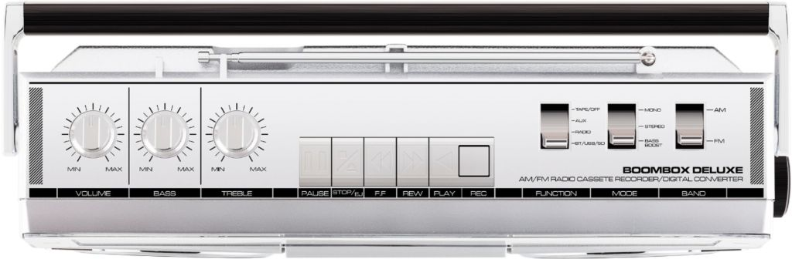
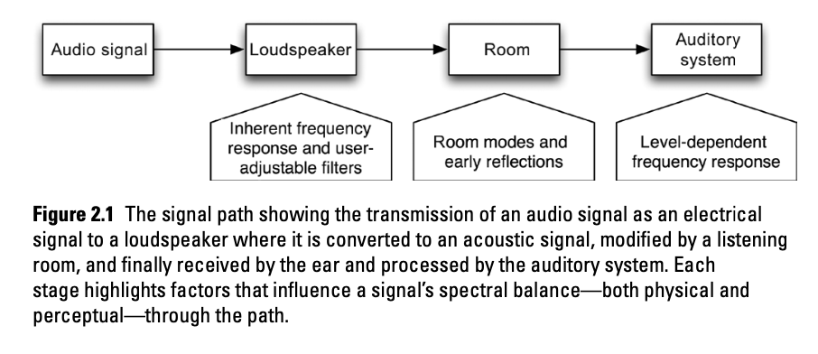
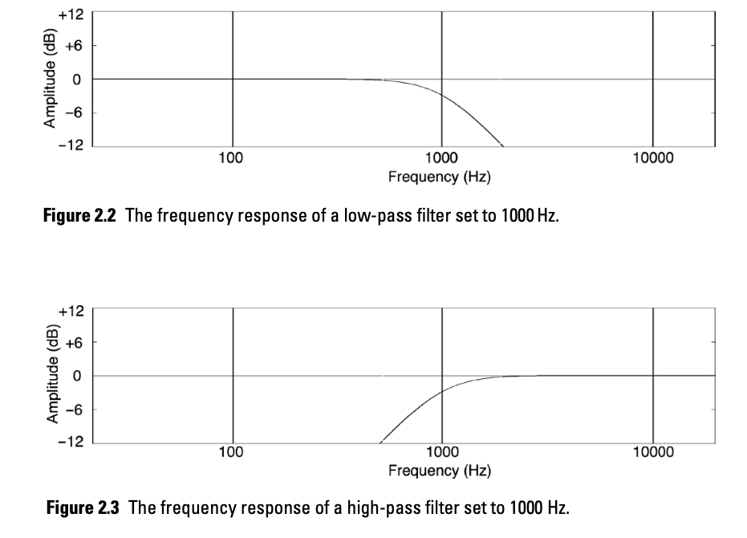
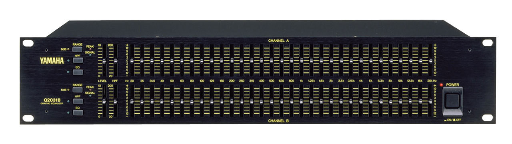
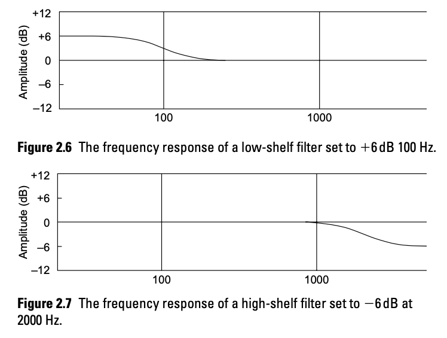
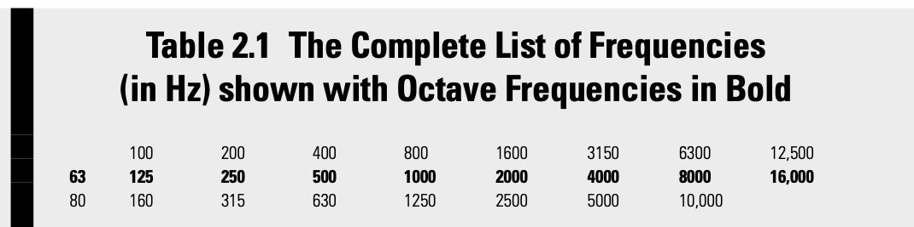

+++
title = "Spectral Balance and Equalization"
outputs = ["Reveal"]
[reveal_hugo]
theme = "moon"
margin = 0.2
separator = "##"
+++

## Spectral Balance

> **Spectral balance** - an audio signal’s frequency content and the relative power of each frequency or frequency band across the audible range of frequencies, from 20 to 20,000 Hz.

{}
Show white noise vs pink noise in Reaper with ReaEQ.

The equalizer is the tool that allows an audio engineer to control spectral balance.

For a recording project, a "flat" spectral balance might mean that all frequency ranges are represented appropriately in the sound. That the highs and lows of a cello show up in a recording, and are not colored negatively by the frequency response of a microphone or other piece of equipment.

While the EQ has the largest effect on spectral balance, every other piece of gear has some effect.

Sometimes the effect of a piece of gear is sought after, like a specific vintage microphone, preamp, or compressor.

An engineer seeks the equalization and spectral balance that is best suited to whatever music is being recorded. For instance, the spectral balance appropriate for a:

- jazz drum kit recording will likely be different from that for
- a rock drum recording,

and an experienced recording engineer, upon listening to two such audio samples, understands and can identify specific timbral differences between them.

One might think that we could use a spectrum analyzer to help with making these decisions. This tool can help occasionally, but is no replacement for well developed ears.

{}

---

# Shaping Spectral balance

---

## Equalization

{}
spectral balance can refer to the relative balance of bass and treble, what can be con- trolled with basic tone controls on a consumer sound system.

You may have first seen a tone control on a stereo or boombox.

The primary way an audio engineer has control over the tonal balance of a sound is through an equalizer. But, there are other and more subtle ways.
{}

---

## Microphone Choice and Placement

- [Charm Studio microphone list](https://docs.google.com/presentation/d/130uChoUPV370sMNJEc02n41QXdygYUO5zVqAWKoa900/present#slide=id.g10e552eff57_0_0) - see frequency response patterns.
- Compare [mic placement](https://cambridge-mt.com/rs2/lmp/) with a different instrument.

{}
Microphone choice and placement has a critical effect on tonal balance in recordings, and should be thought of first before applying equalization. Each microphone has a different frequency response pattern as can be seen in this document above. An engineer will choose a microphone either from previous experience, or through experimentation, recording the same sound with multiple microphones and comparing the results.

Besides a microphone’s frequency response, its physical orientation and location relative to a sound source also directly affect the spectral balance of the audio signal as other factors come into play, such as the polar response of the microphone, the radiation patterns of a sound source, and the ratio of direct sound to reverberant sound at a given location within an acoustic space.
{}

---

## Indirect Factors Affecting Spectral Balance

{}
Because there is no direct connection between the auditory processing center of the brain and digital audio data or analog magnetic tape, engineers need to keep in mind that audio signals are altered in the transmission path between a recorder and the brain.

Let's listen to something in this room, then take it upstairs and try to hear if it is any different.

Who has something they want to listen to?
{}

---

Filters: Low-Pass and High-Pass

---

## Graphic Equalizers

---

## Parametric Equalizers

- Band filters in Reaper
  - Center freq
  - Q = center frequency / bandwidth
  - boost or cut

---

## Shelving Equalizers

---

## Getting Started with practice

[WebTET](https://webtet.net/apcl/#/about)

---

## Practice Types

- matching
- matching memory
- return to flat
- absolute identification

{}

- Matching. Working in Matching mode, the goal is to duplicate the equalization that has been applied by the software. This mode allows free switching between the “Question” and “Your Response” to determine if the chosen equalization matches the unknown equalization applied by the computer.
- Matching Memory. This mode is similar to the Matching mode with one main difference—once gain or frequency is changed, the “Question” is no longer available for auditioning. “Question” and “Bypass” are available to be auditioned freely before any changes to the equalizer are made. Matching Memory mode helps us match sounds by memory and can be considered moderately to very difficult depending on the other practice parameters that are chosen, such as number of bands, time limit, and frequency resolution.
- Return to Flat. In this mode the goal is to reverse or cancel the randomly chosen equalization applied to the audio signal by the computer by selecting the correct frequency and applying equal but opposite gain to what the software has applied. It is similar in difficulty to “Matching” but requires thinking in the opposite way since the goal is to remove the equalization and return the sound to its original spectral balance. For instance, if you hear a boost of 12dB at 2000 Hz, the correct response would be to apply a cut of 12dB at 2000Hz, thus returning the audio signal to its original state and sounding identical to the “Flat” option. Because the equalization used is reciprocal peak/dip, it is possible to completely eliminate any frequency boosts or cuts by applying equal but opposite boosts or cuts to the respective frequencies. It should be noted that, if you wish to try these exercises in a different context outside of the included software practice modules, not all types of parametric equalizers available are reciprocal peak/dip and thus will not be capable of canceling a boost with an equal but opposite cut. This is not a deficiency but sim- ply a difference in design.
- Absolute Identification. This practice mode is the most difficult and the goal is to identify the applied equalization without having the opportunity to listen to what is chosen as the correct response. Only “Bypass” (no equalization) and “Question” (the computer’s randomly chosen equalization) can be auditioned.

{}

---

## Frequency Resolution

- 1 octave—the easiest of the two options with 9 possible frequencies
- 1/3rd octave—the most difficult with 25 possible frequencies

---

---

## Other parameters

- Number of bands
- frequency range
- gain combination
- Sound Source
  - file or pink noise
- Keyboard shortcuts

---

## Working with the EQ Practice Module

- start with pink noise
- set the selection to "your response" and scroll through the frequency options to get them in your ear
- after listening to this for a while try it with a sound file
- note down effected instruments in the loop

---

## Vowel method

- 250 Hz = [u] as in boot
- 500 Hz = [o] as in tow
- 1000 Hz = [a] as in father
- 2000 Hz = [e] as in bet
- 4000 Hz = [i] as in beet

---

## Recommended recordings

- Anderson, Arild. (2004). “Straight” from The Triangle. ECM Records. (jazz piano trio)
- Blanchard, Terence. (2001). “On the Sunny Side of the Street” from Let’s Get Lost. Sony. (jazz with vocals)
- Earth, Wind & Fire. (1998). “September” from Greatest Hits. Sony. (R&B pop)
- Hellendaal, Pieter. (1991). “Concerto II—Presto” from 6 Concerti Grossi. Perf. The European Community Baroque Orchestra. Channel Classics. (Baroque orchestra)

---

- Le Concert des Nations. (2002). “Marche pour la céré- monie” from Soundtrack from the film Tous les matins du monde. Alia Vox Spain. (Baroque orchestra)
- Randall, Jon. (2005). Walking Among the Living. Epic/ Sony BMG Music Entertainment. (roots music/bluegrass)
- Steely Dan. (2000). “Gaslighting Abbie” from Two Against Nature. Giant Records. (pop)
  The Police. (1983). “Every Breath You Take” from Syn- chronicity. A&M Records. (rock)
