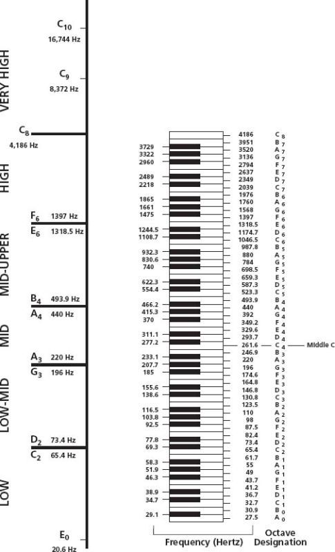
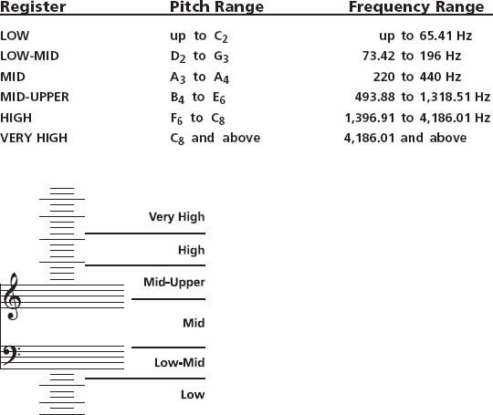

+++
title = "Fundamental Listening Skills"
outputs = ["Reveal"]
[reveal_hugo]
theme = "moon"
margin = 0.2
separator = "##"
+++

## Fundamental Listening Skills

---

{}
It may be a helpful tool for memorization to relate the frequencies we're listening for to pitches on the keyboard. These frequencies and pitches will not match exactly, this is because of the tuning of the keyboard and it's difference from teh harmonic series.
{}

---

{}
This series is generated from a smaller and smaller division of a string.
{}

---

{}
This chart shows the frequencies of each pitch on a piano keyboard along with frequency ranges.

How do these pitches correspond to our ISO frequencies?
{}

---

| ISO Octaves | ET Frequency | Pitch |
| ----------- | ------------ | ----- |
| 63          | 61.7         | B1    |
| 125         | 123.5        | B2    |
| 250         | 246.9        | B3    |
| 500         | 493.9        | B4    |
| 1000        | 987.8        | B5    |
| 2000        | 1976         | B6    |
| 4000        | 3951         | B7    |
| 8000        | N/A          | B8    |
| 16000       | N/A          | B9    |

{}
Here's the ISO octaves and their equal tempered equivalents.
{}

---

## Ranges

