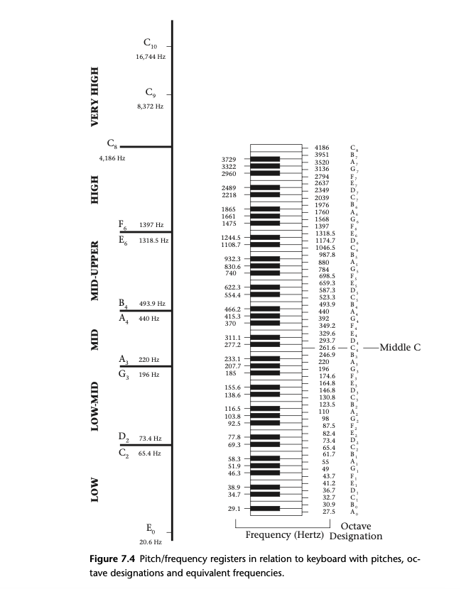
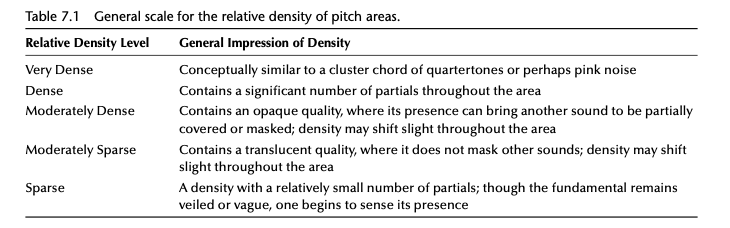
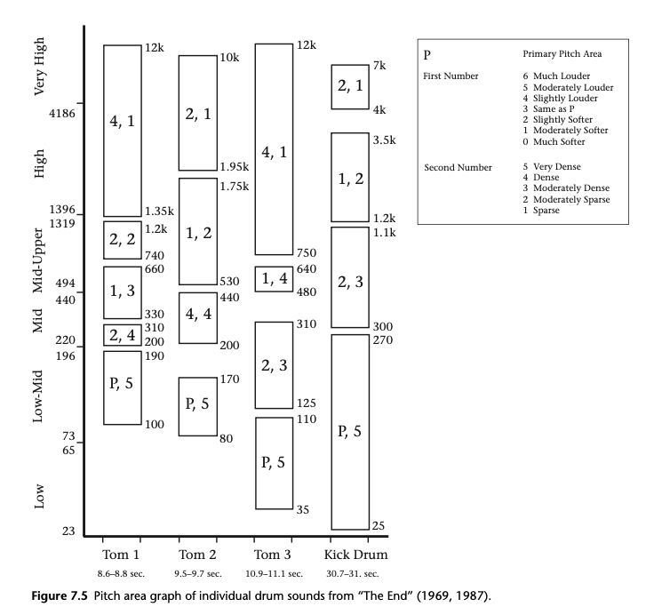

+++
title = "Timbre and Pitch in the Recording Domain"
outputs = ["Reveal"]
[reveal_hugo]
theme = "moon"
margin = 0.2
separator = "##"
+++

## Linkage of Pitch/Frequency and Timbre in Recording

- Pitch and timbre are fundamentally linked in recording.
- Pitch in recording differs from pitch in music, emphasizing psychological aspects.
- Pitch areas and density link pitch and timbre, affecting timbral balance.

{}

- Pitch and timbre's interconnection sets the stage for understanding their individual contributions to recordings.
- The distinction between pitch in recording and music highlights the unique application of pitch in the recording context, focusing on its psychological impact and interaction with timbre.
- By examining how pitch areas and density contribute to timbral balance, we can appreciate the complex interplay between these elements in shaping a recording's character.

{}

---

## Timbre as a Recording Element

- Timbre's dominance in recording's auditory elements.
- Nuanced manifestation of timbre across a track's structure.
- Importance of sound object and acousmatic listening in timbre analysis.

{}

- Timbre, as a dominant recording element, enriches the listener's experience through its varied and complex character.
- The nuanced presence of timbre throughout a track underscores its significance in conveying emotion and atmosphere.
- Understanding timbre through the concepts of sound object and acousmatic listening offers a framework for deeper analysis and appreciation of recording elements.

{}

---

## Observation and Analysis of Timbral Content and Character

- Approaches to listening and sound analysis software use.
- Typology tables and graphing notation for timbre analysis.
- Importance of recognizing instruments and describing timbre’s character.

{}

- This part introduces methodologies for the detailed observation and analysis of timbre, utilizing advanced tools and techniques.
- By employing typology tables and graphing notation, analysts can dissect and describe the intricate aspects of timbre.
- The focus on recognizing and describing timbral content underscores the importance of a nuanced approach to understanding recordings.

{}

---

> The word pitch refers to the mental representation an organism has of the fundamental frequency of sound. That is, pitch is a purely psychological phenomenon related to the frequency of vibrating air molecules. By “psychological,” I mean that it is entirely in our heads, not in the world-out-there; 

---

> it is the end product of a chain of mental events that gives rise to an entirely subjective, internal mental representation or quality. Sound waves—molecules of air vibrating at various frequencies— do not themselves have pitch. Their motion and oscillations can be measured, but it takes a human (or animal) brain to map them to that internal quality we call pitch.
>
> (Levitin 2006, 22)

---

## The Linkage of Pitch/Frequency and Timbre as Recording Elements

- Pitch: A psychological phenomenon related to sound frequency
- Pitch Perception: Relative vs. Absolute Pitch
- The Octave: A critical perceptual mechanism in understanding pitch
- Fundamental Frequency: The basis of pitch in sound

{}

- Pitch is not inherent in sound waves but is a mental representation of the frequency of these waves. It is subjective, experienced internally and varies from one individual to another.
- Humans generally use relative pitch to perceive music, identifying pitches in relation to one another, unlike the rare ability of absolute pitch which allows for the identification of note frequencies without reference. This relative perception enables musical transposition and consistency across different tuning standards.
- The concept of the octave, where pitch sensation duplicates at double or half the frequency, underscores the human perceptual framework for organizing pitch. It illustrates how pitch and frequency are intertwined in our sensory experience.
- The fundamental frequency, or the rate at which a sound-producing body vibrates, underpins our perception of pitch. This frequency is key in defining the pitch of both pure and complex tones.

{}

---

<!--  -->

{}
The fundamental frequency is the frequency at which a body (such as a guitar string) vibrates; this vibration along its entire length is its resonant frequency (see Figure 7.1).

Figure 7.1 illustrates the vibration of a string. The vibration (and standing wave) along its entire length is the fundamental frequency (the first harmonic). The string also vibrates in halves (2nd harmonic), in quarters (4th harmonic), in eights (8th harmonic), and in sixteenths (16th harmonic) which are all in octave relationships to the fundamental frequency and reinforce its perceptual presence. The third harmonic represents a perfect fifth relationship (plus an octave) to the fundamental; it, along with its octave doublings (the 6th and 12th harmonics), also reinforce the dominance of the fundamental frequency and strengthen it as the pitch sensation.
{}

---

## Complex Tones and the Spectrum of Sound

- The concept of complex tones
- Distinction between harmonics and overtones
- The role of the harmonic series
- Perception of pitch and the impact of waveforms

{}

- Complex tones include frequencies beyond the fundamental frequency, termed 'partials,' which together form the 'spectrum' of the sound. The spectrum is a critical component of timbre, alongside dynamic and spectral envelopes.
- Harmonics are integer multiples of the fundamental frequency, enhancing the sensation of pitch, while overtones, being in inharmonic ratios, can diminish pitch clarity. This classification impacts the analysis of a sound's content and character.
- The harmonic series, especially through low-integer multiples of the fundamental frequency, can establish a pitch sensation even without a fundamental frequency present, a phenomenon known as the 'missing fundamental.'
- Pitch perception varies with the waveform's periodicity. Sounds with periodic waveforms are typically perceived as pitched, whereas non-periodic waveforms result in sounds perceived as unpitched or with less defined pitch.

{}

---

---

## Interactive Activity

- [Harmonics](https://alexanderchen.github.io/harmonics/)
- [Overtone Series (aka Harmonic Series) in Music](https://muted.io/overtone-series/)
- [Let's Learn About Waveforms](https://pudding.cool/2018/02/waveforms/)

---

## The Role of Timbre in Pitch Perception

- Timbre's crucial influence on pitch clarity
- Continuum between white noise and pure pitch sensation
- Complex tones vs. pure tones in pitch reinforcement
- Variable pitch definition due to spectral content

{}

- Timbre significantly affects the clarity of pitch, acting as a decisive factor in how we perceive pitch sensations. This relationship is not binary but spans a spectrum from the ambiguity of white noise to the clear sensation of a singular pitch.
- The perception of pitch is not static; it exists on a continuum. At one extreme, white noise lacks a discernible pitch, while at the other, a pure tone offers an uncompromised pitch sensation. Timbre bridges these extremes, shaping our experience of pitch.
- Complex tones, which include multiple frequencies or harmonics, often provide a more pronounced pitch sensation than pure tones. This is because the presence of a fundamental frequency, along with its harmonics, can enhance the overall pitch perception. However, this enhancement is not guaranteed for all complex tones.
- The concept of "pitch definition" reflects the clarity or focus of pitch perception, influenced by the harmonic content of a sound. Sounds with low-integer harmonics tend to have a stronger pitch sensation due to the reinforcement of the fundamental frequency, whereas sounds with numerous overtones might experience a reduction in pitch clarity.

{}

---

## Pitch Sensation in Non-periodic Sounds

- Impact of inharmonic frequencies on pitch perception
- Pitch areas in non-periodic waveforms
- Role of frequency bands in defining pitch areas
- Timbre's influence on pitch sensation in recording

{}

- Non-periodic waveforms, which include a significant portion of inharmonic frequencies, generally lead to a weaker pitch sensation. These sounds often fall outside traditional notions of being pitched or unpitched, inhabiting a nuanced "pitch area."
- A "pitch area" is characterized by a dominant frequency band or bands, with defined upper and lower boundaries and a specific density of frequency information. This concept helps to categorize sounds that do not fit neatly into the pitched/unpitched dichotomy, offering a more nuanced understanding of pitch perception.
- The density and arrangement of frequency bands within a sound define its pitch area, affecting how the sound is perceived in terms of pitch. Instruments like drums and cymbals, which produce rich timbral sounds, generate pitch areas that can span musical intervals, allowing them to integrate into the harmonic fabric of music.
- In the realm of recording, the spectral content of a sound—its timbre—plays a pivotal role in defining the pitch sensation and the clarity of any perceived pitch. Even sounds with dense, inharmonic partials can convey a sense of pitch, depending on their spectral characteristics and the listening context.

{}

---

## Timbre: Beyond Pitch and Loudness

- Timbre as a Unique Auditory Sensation
- Defined by Difference, Not by Components
- Gestalt Percept: The Whole Is Greater than the Sum of Its Parts
- The Multifaceted Nature of Timbre

{}

- Timbre allows listeners to distinguish between sounds with the same pitch and loudness, emphasizing its role as a unique auditory sensation. The American National Standards Institute defines timbre by identifying it through its difference from pitch and loudness, highlighting the challenge of defining timbre directly.
- As a gestalt percept, timbre is understood as a singular impression that emerges from the complex interaction of its parts. This perspective underscores the complexity of timbre, which integrates various dimensions including pitch, frequency, and amplitude.
- Timbre's multifaceted nature is evident across different levels—from individual sounds to genres of music—functioning as a key attribute in shaping auditory experiences. It encompasses both physical attributes and psychological phenomena, distinguishing it as more than just an auditory sensation but also a carrier of meaning and emotion.
- The examination of timbre involves considering its overall quality and acoustic content, including its spectrum, spectral envelope, and dynamic envelope. This approach allows for a deeper understanding of how timbre contributes to the identity and expressiveness of sounds, beyond mere technical definitions.

{}

---

## Components of Timbre: Unpacking Complexity

- Dynamic Envelope: The Shape of Loudness Over Time
- Spectrum: The Frequency Content
- Spectral Envelope: Dynamic Shapes Within Spectral Content

{}

- The dynamic envelope refers to the changes in loudness or dynamic level of a sound over its duration, typically characterized by the ADSR (Attack, Decay, Sustain, Release) model. This model, however, is a simplification, as actual dynamic contours can be more complex, reflecting the nuances of performance expression and sound production methods.
- The spectrum encompasses all frequency information within a sound, including harmonics and overtones. Partials, which are the individual components of the spectrum, can be stable or vary in frequency and are crucial in forming the perceived pitch and timbre. The presence of formants, frequencies that resonate in the body of an instrument, adds another layer of complexity to the spectrum.
- The spectral envelope represents the dynamic relationship between the various partials in a sound, including their amplitude levels and how these change over time. This component is key to understanding the timbre's intrinsic quality, as it shapes the character of the sound by highlighting certain frequencies over others and evolves as the sound progresses.

{}

---

---

## Interactive Activity

- [Tuning Systems: Equal Temperament vs Just Intonation](https://muted.io/12-tet-vs-just/)
- [Overtones Spiral](https://suonoterapia.org/overtones/)

---

## Acousmatic Listening and Sound as Object

- Acousmatic Listening: Beyond Visual Context
- Sound Object: Isolating Sound from Its Source
- Pierre Schaeffer's Contributions
- Analyzing Timbre and Pitch through Sound Objects

{}

- Acousmatic listening involves experiencing sound independently of its visual origins, focusing purely on auditory perception. This method, inspired by radio and other non-visual media, emphasizes the sound itself over its source, encouraging a deeper analysis of timbre and pitch.
- The concept of the sound object isolates a sound from its context and origin, allowing for an analytical approach that focuses on the sound's intrinsic qualities. This detachment aids in understanding timbre as a recording element, free from external associations or interpretations.
- Pierre Schaeffer, a pioneer in musique concrète, introduced the ideas of acousmatic listening and sound objects to emphasize sound's musical qualities independent of its source. These concepts facilitate a pure analysis of sound, focusing on its characteristics without bias towards its origin.
- By applying Schaeffer's concepts, one can analyze timbre and pitch density in popular music recordings more effectively. This approach removes the interpretative layers that often color our perception of sound, allowing for a more objective analysis based on the content and quality of the sound itself.

{}

---

## Pitch and Frequency in Recording Analysis

- Pitch as a perceptual phenomenon
- Frequency as a measurable scientific concept
- The relationship between pitch and frequency
- The significance of pitch and frequency in recording

{}

- Pitch, in the context of recording, is a psychological experience influenced by frequency vibrations, distinct from its musical organization. It necessitates human perception to be recognized and judged.
- Frequency involves periodic oscillations and can be quantified without the need for human perception. It represents the physical aspect of sound waves, unlike pitch, which is more about the listener's interpretation.
- The interplay between pitch and frequency is crucial in understanding sound in recording. Pitch is formed by the relationships within the frequency spectrum, shaping our perception of sound's timbre and octave replication.
- Recognizing the distinction and connection between pitch and frequency enriches recording analysis, aiding in the comparison with musical contexts, and enhancing understanding of sound's spatial relationships and timbral balance.

{}

---

## Pitch/Frequency Registers 

- Division of the hearing range into pitch/frequency registers
- The purpose and application of pitch/frequency registers
- Learning to recognize pitch/frequency register boundaries
- Utilization of pitch/frequency registers in analysis

{}

- The hearing range is segmented into pitch/frequency registers to facilitate the identification and evaluation of sounds within specific pitch/frequency content. This aids in precisely placing sounds within a track's range.
- These registers are designed to make recognizing pitch/frequency levels easier and to serve as a reference for developing the skill of identifying the boundaries between registers. This concept is vital for various analytical processes in music and recording.
- Recognizing the boundaries between pitch/frequency registers, which are transition areas rather than strict separations, is crucial. It helps in the accurate categorization and analysis of sound.
- Pitch/frequency registers are extensively used in sound analysis, including pitch area, pitch density, and timbral balance assessments. Understanding these registers allows for a nuanced analysis of sound quality, environmental characteristics, and the spectral content of recordings.

{}

---

---

## Understanding Pitch Areas 

- Concept of pitch areas in sound analysis
- Recognition of primary and secondary pitch areas
- The role of pitch areas in timbral balance
- Influence of performance intensity on pitch areas

{}

- Pitch areas represent bands within which sounds, particularly from unpitched percussion, manifest dominant frequency content, distinguishing them by their perceived 'height' in pitch. 
- A sound's spectrum may include a primary pitch area, which is the most pronounced, and one or more secondary pitch areas that are less dominant. 
- Identifying pitch areas within sounds contributes significantly to analyzing and appreciating the textures of timbral balance in music and recordings. It allows for a nuanced appreciation of how these sounds interact within a composition's overall sound spectrum.
- The dynamic relationships between primary and secondary pitch areas, and their variations with changes in performance intensity, highlight the importance of intensity in shaping the timbre of both unpitched and pitched sounds. This underscores the role of performance dynamics in sound analysis.

{}

---

## Analyzing Pitch Areas of Unpitched Sounds

- Graphing and defining pitch areas
- Characteristics of primary and secondary pitch areas
- Impact of performance intensity on pitch areas
- Generalization in analyzing pitch area content

{}

- Pitch areas of unpitched sounds can be graphically represented by delineating the width and register of the primary pitch area and noting the density of pitch/frequency activity within it. This establishes a foundation for detailed sound analysis.
- Secondary pitch areas are identified by their boundary frequencies/pitches and the density of pitch/frequency activity within these areas. Understanding these variables enhances the analysis of a sound's complexity and its role within a composition.
- The dynamic relationships between secondary pitch areas and the primary pitch area's performance intensity offer insights into how variations in intensity affect the perceived pitch and timbre of sounds. This aspect is crucial for a nuanced understanding of sound properties.
- Analyzing pitch areas involves generalizing certain aspects such as time/temporal characteristics, frequency/pitch content, and loudness levels. This approach simplifies the complex nature of sounds into more manageable segments for analysis, focusing on the overall impression rather than minute details.

{}

---

## Analyzing Pitch Areas of Unpitched Sounds

- Generalization of pitch area content
- Summarizing sound characteristics
- Simplification for initial observations
- Pedagogical advantages of the approach

{}

- By generalizing pitch area content, the approach simplifies the analysis by focusing on time/temporal characteristics, frequency/pitch content, and loudness levels, consolidating the entire sound duration into a single impression. This method overlooks changes over time, providing a broad overview instead.
- The method involves summarizing key sound characteristics — time, frequency/pitch, and loudness — into an overall impression. This condenses complex frequency and loudness information, facilitating a general understanding of the sound's timbre.
- Simplification through this approach aids initial observations, making it easier to grasp the concept of pitch areas. It focuses on the most apparent aspects of the sound's spectrum, setting the stage for more detailed analysis.
- This pedagogical approach helps learners to initially distinguish pitch areas more easily than individual frequencies. It serves as an entry point to deeper timbral analysis by emphasizing the overall quality and boundaries of pitch areas, paving the way for identifying specific frequencies within.

{}

---

## Generalizing Density and Loudness in Pitch Areas

- Simplified observation scale
- Relative density levels
- Interpretation and application
- Transition from unpitched to pitched sounds

{}

- Observations within pitch areas simplify the analysis by generalizing the amount of density and loudness levels. This approach facilitates quicker, albeit broad, assessments of the sound's characteristics, laying the groundwork for more nuanced analysis if needed.
- Five levels of density—very dense, dense, moderately dense, moderately sparse, and sparse—provide a framework for evaluating the concentration of partials within a pitch area. This scale ranges from a sound's opaque quality that can mask other sounds to a translucent quality where the fundamental tone begins to emerge.
- The use of subjective terms like "very dense" or "sparse" to describe the density of pitch areas, though imprecise, offers a practical method for quickly grasping the general texture of the sound. This approach requires some degree of listening skill and conceptual understanding but can be learned and applied with experience.
- This generalized method allows for the identification of transitions within sounds, from unpitched to pitched, as changes in density and the emphasis on harmonics reveal the underlying pitch characteristics. It highlights how variations in density can influence the perception of a sound's pitch quality.

{}

---

---

## Graphical Analysis of Pitch Areas in Drum Sounds

- Graphical representation of drum sounds
- Dynamic and density variations with performance intensity
- Primary and secondary pitch areas
- Application in timbral analysis and recording

{}

- The pitch area graph visually represents individual drum sounds, highlighting the primary pitch area, secondary pitch areas, and their dynamic relationships to performance intensity. It pinpoints specific moments in a track, focusing on a single drum hit as the sound object for analysis.
- Changes in loudness and density within pitch areas are observable with variations in the drum's striking intensity. These variations influence the drum's timbre, demonstrating how performance intensity directly affects the sound's spectral characteristics.
- The graph distinguishes primary pitch areas (labeled with 'P') from secondary pitch areas (indicated by numbers reflecting relative loudness levels). This visualization aids in understanding the complex spectral content of drum sounds, including their bandwidth and the distribution of energy within specified ranges.
- This analytical approach is valuable for exploring the timbre of drums and other unpitched sounds within a recording. It enables a deeper understanding of how these sounds contribute to the overall timbral balance of a track, offering insights into the textural and spectral composition of the music.

{}

---

