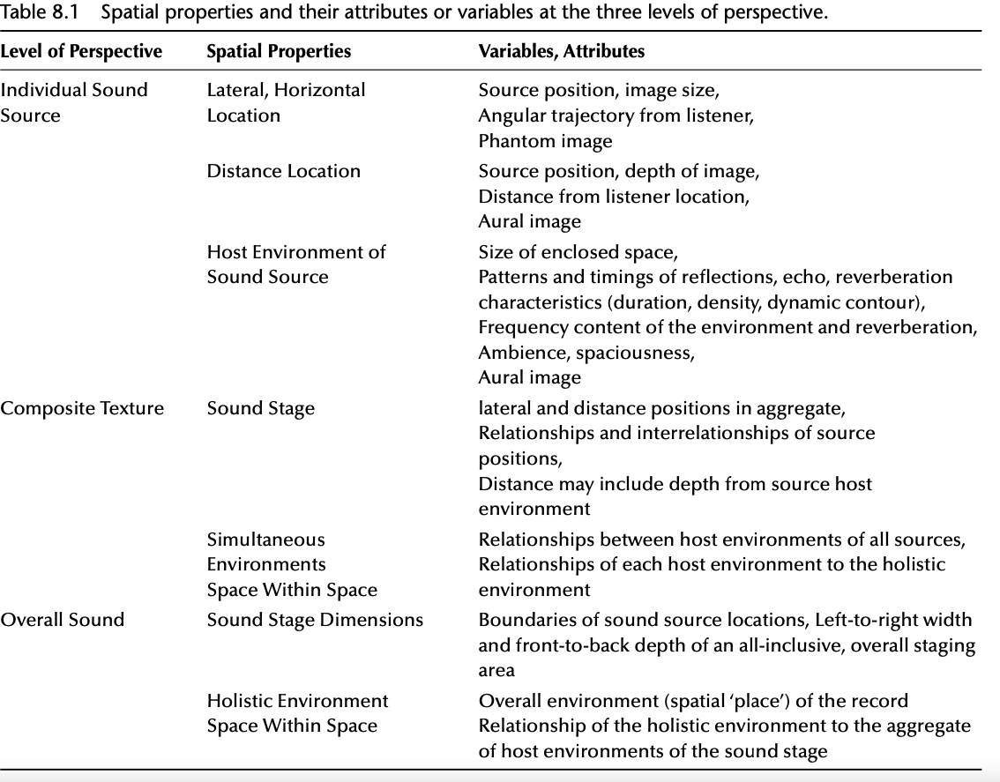
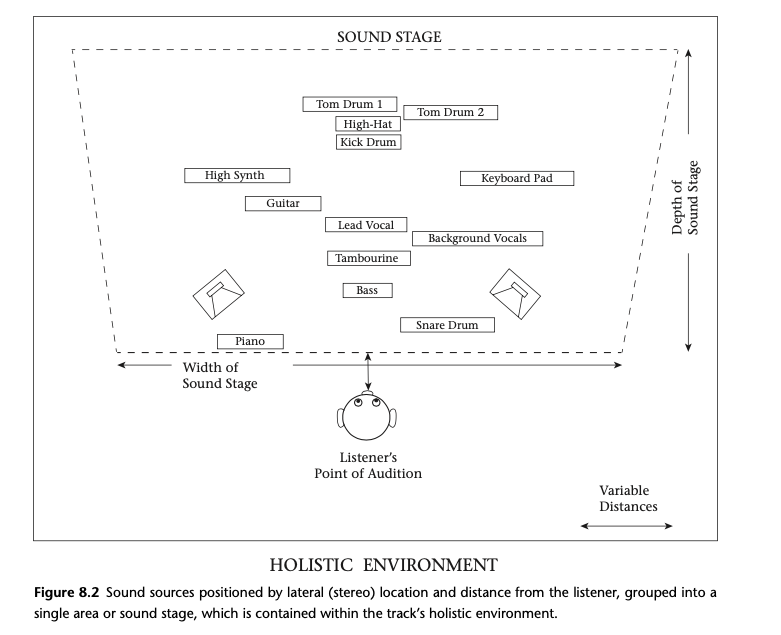
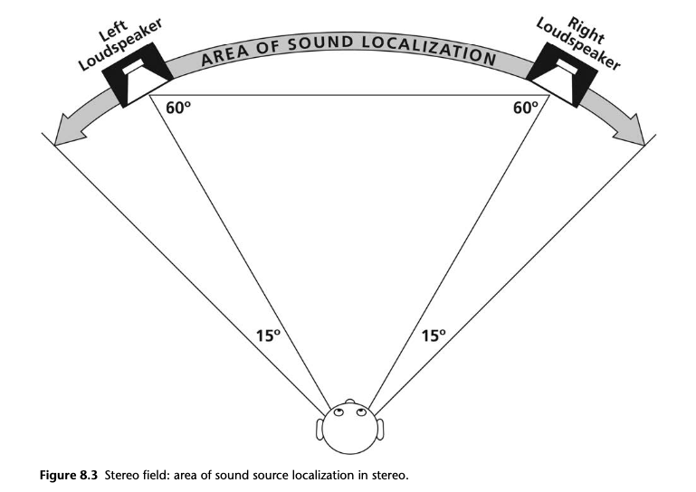

+++
title = "The Illusion of Space as an Element of Recording"
outputs = ["Reveal"]
[reveal_hugo]
theme = "moon"
margin = 0.2
separator = "##"
+++

## Playback formats:

- Mono
  - single channel; could be multiple speakers
- Stereo (two independent channels)
- Surround sound
  - 5 - 7 independent channels and a possible subwoofer

{}
**Mono** was the only format of early popular music recordings. Stereo (with its two independent chan­nels) established a presence in the mid-1960s, and quickly dominated the market; initially two independent mixes were created: first for mono and an after-thought mix in stereo. Stereo is currently the default commercial format, and mono versions are now typically reductions of the stereo to a single channel. ‘Collapsed’ or ‘folded-down stereo’ merge the two channels of stereo into mono; this results in phase cancellations and other anomalies that alter the track, sometimes considerably. Mono records can be reproduced over two channel systems (sending the same information to both speakers producing “mirrored mono”) or over a single loudspeaker; these appear as either the center speaker of Figure 8.1 or the combined left plus right speakers.

**Stereo and surround sound** playback formats locate sources very differently in relation to the point of audition. The listener is presented with sound arriving from different directions, different number of directions, and listening cues differ between the two formats, altering percepts. Each format provides a very different experience, with striking differences to source localizations, width and depth, and artistic treatments of sources; they shape the artistic statement of the track in very different ways.
{}

---

## Spatial Properties and Attributes

- Sonic illusions
  - Angular direction and width - sounds located at a direction and distance from the listener
  - Span of distance location and depth - sounds with size
  - coming from real or imagined rooms

---

## Spatial Properties and Levels of Perspective

- Three levels of perspective
  - Individual sound sources and their attributes
  - Composite texture of interrelationships of sound sources
  - Overall sound

---

{}

**We first focus on the individual instruments.** A spatial identity for each instrument, voice, or any other sound within the track results from
(1) their left-right lateral placement,
(2) their position of distance from the listener, and
(3) the attributes of the individual host environment (space) they are perceived as occupying.

**Next we can perceive how sources interact with one another.** This is also known as the composite texture. In evaluating the **sound stage**, placements of sounds may establish groupings; the sounds dispersed across the stereo field and the depth of field can bond in various ways as a result of their timbral content, musical functions, staging placement, etc. Sources coalesce into groups within regions of the sound stage, and some may be isolated or delineated. This provides a connection or separation of sources and also of the materials they present; it also impacts the density of sound, and all that might entail.

**Host environments** of sources also establish relationships with the host environments of other sources, perhaps also generating percepts of distance and depth. Each instrument or voice might have its own ‘host environment’ (its own acoustic space, artificial room, reverb, etc.); relationships forming between instruments/voices are rarely akin to occurrences of naturalistic acoustic spaces.

{}

---

{}
At the level of composite texture, the interaction of sources and spatial dimensions is evaluated. This contrasts with the spatial attributes of individual sound sources that are observed and evaluated at the track’s basic-level, above. Figure 8.2 illustrates these three perspectives: lateral and distance positioning of individual sound sources, composite staging of source image positions, and the placement of all sources within a holistic environment for the track. The identified sound stage width and depth can vary widely between tracks, as can the distance between the listener and the front edge of the sound stage.
{}

---

## STEREO LOCATION: ANGULAR DIRECTION AND IMAGE WIDTH

{}
Lateral (or stereo) location is the topic that arises when many think of a record’s spatial properties. It is the perceived lateral position of sound sources; their locations within the boundaries of the stereo array, calculated at an angle left or right from the listener’s forward facing center.
{}

---

{}
Sound sources may be perceived at any lateral location within the stereo field, Figure 8.3. Sounds may be situated at either loudspeaker, though the majority of sound sources are located elsewhere, where no loudspeaker exists. “The stereo space acts as a sort of window through which the listener can ‘view’ the location of sounds. Not only in an overlapping construction but in a complex and dispersed structure” (Camilleri 2010, 201).

Sound sources that appear without a physical presence are phantom images. The majority of sound images in nearly all stereo tracks are **phantom images**. Phantom images (and the sound sources they represent) may appear anywhere between the two loudspeakers, and up to 15° beyond (outside) each loudspeaker position.
{}

---

## Image Width

- Shifting Width - Phil Collins’ “In the Air Tonight” (1981)
- Point sources - Paul Simon’s Graceland (1986)
  - Gumboots - electric guitar sounds in the introduction
  - Crazy Love II
  - Under Africa Skys
- Spread image - Beatles’ “She Came in Through the Bathroom Window” (Abbey Road 1969, 1987).

{}
Aural images (whether phantom images or located at a loudspeaker) also have a width dimension. This attribute is significant for the track, and it is often overlooked. Width provides the illusion of a physical size to the sound source. Aural images have edges or boundaries on the left and right sides.They may be of any size width, spanning the extremes from occupying the entire breadth of the stereo field, to a very narrow point.

Images may also **change in width—at any time and by any amount**. Subtle changes are common within instrumental or vocal lines, and more pronounced changes are common between song sections. Interesting examples of shifting image widths and positions give the sparse accompaniment of Phil Collins’ “In the Air Tonight” (1981) motion and direction, as well as suspense and tension, beginning with the first electric guitar sound.

Images that are very narrow in width, and clearly distinct as occupying a concentrated spot are **point source images**. Examples of point source images are not common. Sources in high frequency ranges produce point sources more readily, as these sounds tend to radiate less and be more directional. Lower frequency sources typically have resonant bodies that help the lower frequencies to radiate more, and thus provide the sounds with a sense of width. Paul Simon’s Graceland (1986) provides some interesting examples of point sources.

More typical point sources appear in the collection of metal percussion sounds within the introduction and coda sections of “Under African Skies”; these sounds remain as focused points while shifting between lateral positions.
{}
