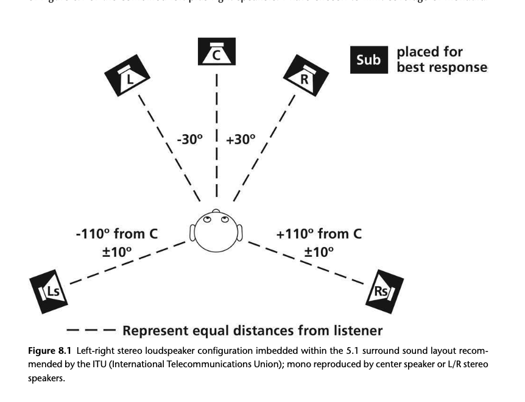

+++
title = "The Illusion of Space as an Element of Recording"
outputs = ["Reveal"]
[reveal_hugo]
theme = "moon"
margin = 0.2
separator = "##"
+++

## The Illusion of Space as an Element of Recording

- The artistic redefinition of space in recordings
- The role of spatial properties in shaping sound
- The significance of ecological perception in recording
- Exploring spatial properties and listener engagement

{}

- Every track reimagines the physics of space to enhance artistic expression, defying conventional acoustics to create unique auditory experiences.
- Spatial properties, alongside timbre, are crucial in molding the overall sound and identity of a track, adhering to the principles of uniqueness and equivalence.
- Ecological perception, as discussed in psychoacoustics, underscores the importance of understanding spatial properties through an ecological lens, offering insights into how listeners interpret and engage with music.
- This exploration includes defining spatial properties, understanding the listener's point of audition, and addressing the challenges of perceiving the spatial attributes of sound, emphasizing their aesthetic value in crafting a track's reality and listener experience.

{}

---

## Hearing Invisible Sounds in Virtual Spaces

- The unique challenge of engaging with spatial properties in music
- Differences between everyday listening and listening to records
- The role of acousmatic listening in understanding spatial properties
- Developing skills to perceive spatial attributes without visual cues

{}

- Listening to recordings demands a shift from our usual multimodal perception of space, highlighting the importance of spatial properties without the aid of visual confirmation.
- In contrast to everyday experiences where visual cues dominate spatial understanding, listening to music focuses on spatial properties in the absence of visual support, challenging our conventional engagement with sound.
- Acousmatic listening—focusing on sounds without seeing their source—requires a reorientation of our listening habits, emphasizing auditory cues over visual ones to identify and localize sounds.
- Developing the ability to perceive spatial attributes in music requires relearning and sensitizing ourselves to sonic qualities that define space, distance, and orientation, thus enhancing our engagement with invisible sound sources in recordings.

{}

---

## Understanding Listener Perspective 

- Defining the listener's point of audition
- Impact of playback format on spatial perception
- Differences between stereo, mono, and surround sound formats
- Challenges and considerations in analyzing spatial properties

{}

- The listener's perspective, or "point of audition," is a conceptual location from which the spatial properties of a track are observed and analyzed, offering a stable point of reference for understanding the spatial relationships within a recording.
- Playback format significantly influences how spatial properties are perceived, with stereo sound being the most common format for music consumption, characterized by two independent channels that provide a distinct spatial experience.
- Mono and surround sound represent alternative formats, each offering different challenges and opportunities for analyzing spatial properties; mono focuses on distance and depth without the directional cues of stereo, while surround sound offers a more immersive experience with multiple directions of sound.
- Analyzing spatial properties requires an understanding of how each playback format shapes the listener's experience, necessitating a shift in analytical approach to account for the unique spatial dynamics of stereo, mono, and surround sound, and recognizing the limitations and possibilities inherent in each.

{}

---

---

## Spatial Properties

- Creating synthetic spaces and pseudo-realities in recordings
- The illusion of sounds in space: direction, distance, and size
- Categories of spatial properties: 
  - Angular direction, 
  - distance, 
  - and environment dimensions
- Interaction and complementation of spatial attributes

{}

- Spatial properties in music production can conjure up a synthetic space, presenting a pseudo-reality where sounds originate from impossible locations, offering listeners a unique auditory experience that transcends real-world limitations.
- Through the use of sonic illusions, sounds can be perceived to come from specific directions, distances, and even appear to have size within a virtual space, allowing for a dynamic and immersive listening experience that defies physical constraints.
- These properties are categorized into angular direction and width (how sound is positioned around the listener), the span of distance and depth (how far away the sound seems), and the dimensions of the environment (the perceived space where the sound originates, both specific to the sound and the track as a whole).
- The attributes of these spatial properties work together to create a cohesive sonic environment, interacting in ways that enhance the listener's perception of the track, making the experience of listening both complex and captivating.

{}

---

## Spatial Properties and Levels of Perspective

- Three levels of perspective
  - Individual sound sources and their attributes
  - Composite texture of interrelationships of sound sources
  - Overall sound

---

{}

- The spatial identity of individual sound sources is determined by their lateral placement, distance from the listener, and the specific environmental characteristics they are perceived to occupy. This virtual aural image adds depth and dimensionality, making each sound unique within the track.
- In a composite texture, sources interact at a level of equal significance, with their spatial relationships enhancing the listener's perception of the track's overall texture and depth. The concept of equivalence applies here, emphasizing the balanced attention to each sound source within the spatial framework.
- The evaluation of the sound stage involves analyzing how sound sources are grouped or isolated across the stereo field, affecting the track's density and the listener's engagement with the music. These groupings create a dynamic interplay of musical and spatial elements, contributing to the track's complexity.
- Dynamic host environments, where each sound source occupies a unique or surreal space, interact with each other, contributing to the perception of distance and depth. This complex network of relationships between the host environments of different sources shapes the auditory landscape of the track, creating a rich and engaging listening experience.

{}

---

## Integrating Spatial Dimensions 

- Composite texture and spatial interaction of sound sources
- Sound stage dimensions: Width, depth, and listener distance
- Holistic environment: The aggregate spatial context of a track
- Challenges of incorporating elevation into stereo recordings

{}

- At the composite texture level, the interaction among sound sources and their spatial dimensions is critically assessed, highlighting how individual sound elements coalesce within the broader spatial framework of a track.
- The sound stage, defined by its width and depth as well as the distance of sound sources from the listener, varies significantly across tracks, offering a diverse range of auditory experiences. This stage serves as a spatial boundary within which sound sources are positioned and interact.
- The holistic environment concept encapsulates the entire spatial narrative of a track, merging individual sound source environments and the sound stage into a comprehensive, often surreal, spatial setting. This global environment contains all spatial properties, providing a contextual foundation for the track's spatial dynamics.
- Incorporating elevation, or vertical sound placement, into stereo recordings poses technical challenges due to the limitations of stereo's horizontal plane. While surround sound formats introduce the possibility of vertical dimensionality through additional channels, stereo records primarily rely on lateral and depth cues for spatial representation.

{}

---

---

## STEREO LOCATION: ANGULAR DIRECTION AND IMAGE WIDTH

- Lateral positioning and perception in stereo recordings
- Creating illusions of sound placement within the stereo field
- The concept of phantom images in sound source localization
- Defining the width of the sound stage through lateral placement

{}

- Lateral location, or the perceived position of sound sources within the stereo field, is often the first aspect considered when discussing a record's spatial properties. This encompasses how sounds are positioned left or right of the listener's central focus, within the boundaries defined by the stereo speaker setup.
- The illusion of sound placement, where sounds appear to emanate from positions without a physical source, is a hallmark of stereo sound. These illusions are created through the interaction of the left and right stereo channels, crafting phantom images that can be perceived anywhere between and slightly beyond the two loudspeakers.
- Phantom images represent a core technique in stereo mixing, allowing sound sources to be perceived in locations where there are no physical speakers. This effect enhances the spatial dimensionality of a track by creating a wider and more immersive sound stage.
- The sound stage width is determined by the lateral extremities of sound source placements within the stereo field. The furthest left and right sound source images define the lateral boundaries of the sound stage, contributing to the overall spatial impression of a recording.

{}

---

---

## Psychoacoustics of Stereo Sound Localization

- Fundamentals of perceiving direction and phantom images
- Interaural cues essential for sound localization
- Importance of spectral content in source localization
- Challenges and nuances of assessing stereo localization

{}

- Understanding how we perceive sound direction in stereo recordings involves grasping the psychoacoustic principles behind sound localization, where interaural time differences (ITD), interaural amplitude differences (IAD), and interaural spectral differences (ISD) play pivotal roles. These cues, influenced by the differences in sound waves received by each ear, are crucial for identifying the lateral position of sound sources within the stereo field.
- ITD and IAD are primary cues for localization, with ITD focusing on the timing of sound arrival to each ear and IAD on the intensity levels. Spectral content, altered by the unique shape and structure of our outer ears, provides additional cues, especially in frequency ranges where ITD and IAD are less effective.
- The specific frequency content of a sound source can significantly influence its perceived location. For example, high-frequency components in a sound's attack may enable more precise localization, even for sources with predominantly low-frequency content.
- Accurately identifying the lateral positions of sound sources in a stereo mix requires careful consideration of how these interaural cues interact, taking into account individual physiological differences and the potential for variations in hearing acuity between ears. Additionally, the listening environment, whether through headphones or loudspeakers, can dramatically alter the perception of spatial properties, emphasizing the importance of a consistent and accurate point of audition for effective analysis of stereo sound localization.

{}

---

## Image Width

- Shifting Width - Phil Collins’ “In the Air Tonight” (1981)
- Point sources - Paul Simon’s Graceland (1986)
  - Gumboots - electric guitar sounds in the introduction
  - Crazy Love II
  - Under Africa Skys
- Spread image - Beatles’ “She Came in Through the Bathroom Window” (Abbey Road 1969, 1987).

{}

- Image width in stereo recordings is a subtle yet significant property that often goes unnoticed due to its rarity in natural listening experiences. This dimension provides the illusion of physical size to sound sources, with aural images having discernible left and right boundaries that can span anywhere from the entire stereo field to a pinpoint location.
- Point source images are very narrow, focusing sound in a concentrated spot, and are more commonly associated with high-frequency sounds due to their directional nature. Examples from Paul Simon's *Graceland* illustrate both point sources and their subtle expansion through reverberation, highlighting the nuanced use of width in recording.
- Spread images, on the other hand, occupy a wider area within the stereo field, defined by their left and right edges. These images can sometimes appear split across the stereo field, creating a distinct spatial effect, as seen in certain tracks by The Beatles.
- The width of an image significantly contributes to the spatial identity of sound sources within a track, affecting their presence and interaction. Width can be influenced by various factors including amplitude, timbre, and environmental attributes of the sound source. This aspect of sound can dramatically influence the perceived realism of a track, allowing for creative manipulation of spatial properties to enhance the listening experience.

{}

---