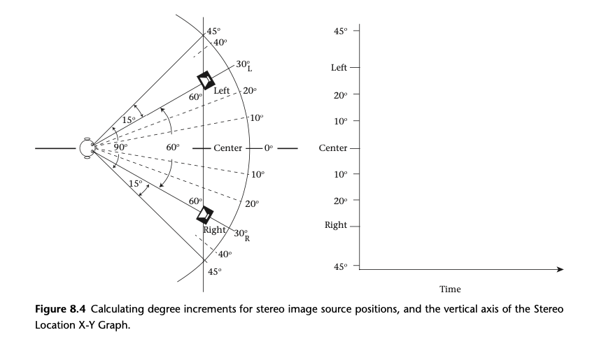
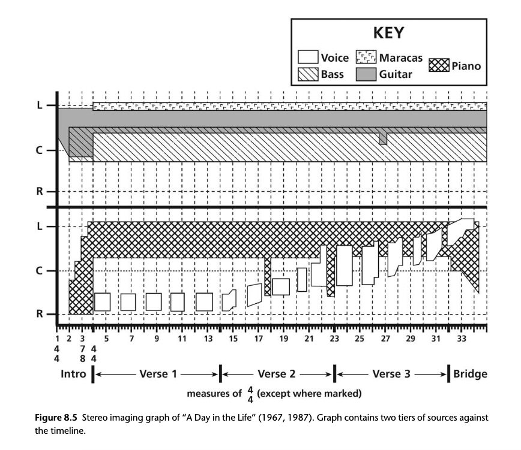
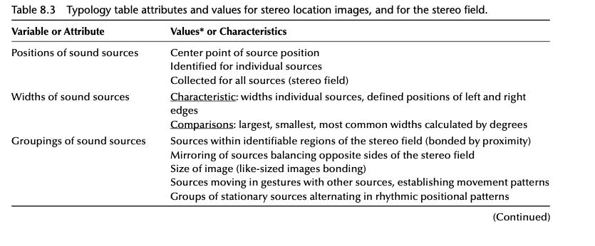
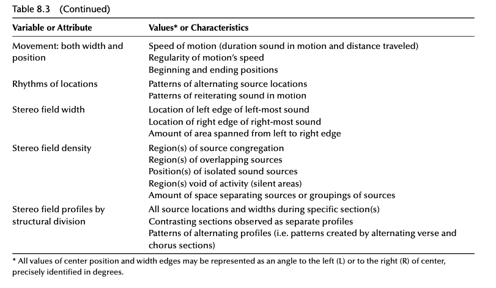

+++
title = "The Illusion of Space as an Element of Recording - Part 2"
outputs = ["Reveal"]
[reveal_hugo]
theme = "moon"
margin = 0.2
separator = "##"
+++

## Dynamics of Sound Source Movement

- Fluidity of image locations in audio tracks
- Impact of motion on spatial audio perception
- Relationship between movement and image width
- Rhythmic spatialization through sound movement

{}

- Sound sources in audio production are not static; their locations can shift dramatically or subtly across the stereo field, mirroring the dynamism found in visual media. This movement enhances the spatial depth and realism of the audio experience.
- The movement of sound sources, from gradual sweeps to sudden jumps, plays a significant role in shaping the listener's spatial awareness and engagement with the music. Such movements can make the audio landscape feel more alive and immersive.
- Changes in a sound source's position often occur alongside modifications in its width, adding a layer of complexity to the audio experience. These shifts are more noticeable to listeners due to everyday experiences with moving sounds, making them effective tools in audio production.
- The concept of rhythmic spatialization involves creating rhythmic patterns through the strategic movement of sounds across different spatial locations. This technique adds a dynamic spatial dimension to the rhythm, enriching the listener's engagement with the track.

{}

---

## Musical Examples of Sound Source Motion

- "Here Comes the Sun" by The Beatles: Moog synthesizer movement
- "You Never Give Me Your Money" by The Beatles: Vocal image widening and moving
- "In Your Eyes" by Peter Gabriel: Rhythmic spatialization

{}

- In "Here Comes the Sun," a Moog synthesizer sound travels from the left to the center of the stereo field, demonstrating controlled movement over four beats. This example highlights how motion can be precisely planned and executed within a track to create a sense of dynamism and change.
- "You Never Give Me Your Money" features the lead vocal starting as a narrow image, then widening and moving across the stereo field. This gradual transition contributes to a dynamic and evolving sound landscape, showcasing the effective use of spatial manipulation in audio production.
- Peter Gabriel's "In Your Eyes" employs rhythmic spatialization, where percussion and drum sounds move across the sound stage, creating a rich rhythmic pattern. This technique demonstrates how movement between sounds can add a complex spatial dimension to the rhythm, enhancing the overall listening experience.

{}

---

## Observing Stereo Images

---

## Hearing Audio Images

- Initial focus on image centers
- Identifying the boundaries of sound images
- Developing the skill through practice and repetition
- Importance for audio analysis

{}

- Beginning with the center of an audio image is a natural starting point for auditory exploration. This method helps establish a basic understanding of the sound's location within the stereo field, offering a foundation upon which further details can be discerned.
- Focused attention is required to identify the edges of spread images, a task that demands an understanding of where the sound isn't to better comprehend where it is. This involves a gradual narrowing of focus, moving from the known to the unknown, to map out the precise boundaries of the sound image.
- Like many auditory skills, the ability to discern the edges of sound images is developed through practice and repetition. It's a nuanced skill that requires patience and deliberate listening efforts to refine.
- Engaging with the width and position of sound images is critical for in-depth audio analysis. Understanding these aspects enriches the listening experience and provides insights into the spatial arrangement of sounds within a track, highlighting the importance of spatial awareness in audio production.

{}

---

Stereo Image Graph Example

{}

- The stereo image graph represents the spatial distribution of sound sources within a track, with positions and widths plotted against time. This visual tool helps in pinpointing where sounds are located in the stereo field and how they interact over the course of the track.
- Edges of sound images are delineated on the graph, marking the boundaries of where sounds begin and end. This is crucial for understanding the full scope of each sound's presence within the stereo mix and identifying the core area each sound occupies.
- To manage complexity, especially with tracks featuring numerous or broad sound sources, sounds can be organized into tiers. This layered approach allows for a detailed comparison of different groups of sound sources against the same timeline, enhancing the clarity of the analysis.
- In analyzing "A Day in the Life" by The Beatles, the stereo image graph provides insights into the movement and width changes of key elements like the piano, acoustic guitar, and John Lennon's vocals. Although the graph simplifies some details for broader observations, it remains a powerful tool for visualizing the dynamic spatial aspects of the track.

{}

---

Ways of writing about stere image:

---

